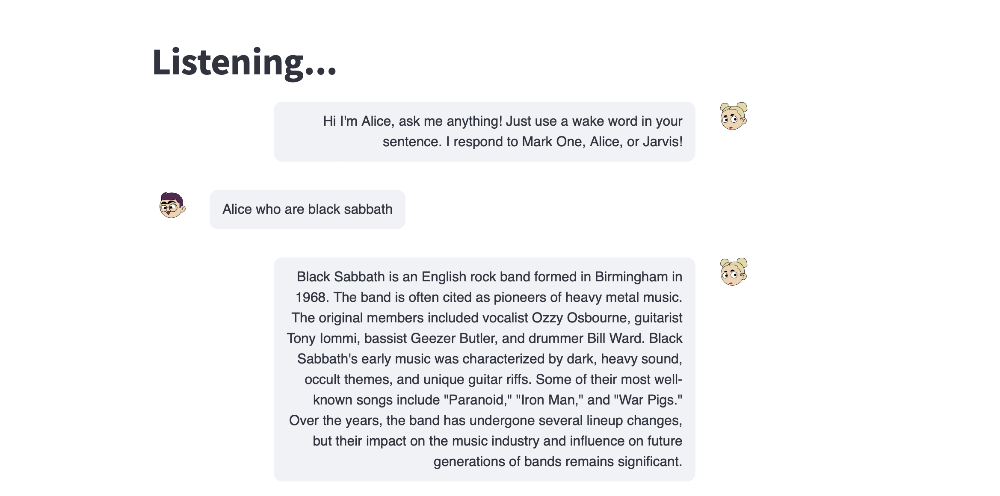

# LLM-based Voice Assistant 
This is an AI Voice Assistant based on Large Language Models. A user can interact with the Voice Assistant in natural language, currently English. 

The implementation brings various deep learning models together: 
- Large Language Model (GPT-4 or Alpaca, can be chosen) 
- Speech-To-Text Model (Wave2Vec2-Large)
- Text-To-Speech Model (Microsoft SpeechT5)

The speech module is interfaced with the local microphone to create live transcription via a VAD Process. A transcription is sent to the chosen LLM for processing based on wake words. 

Once the LLM generates a response, speech module also saves the audio file and generates a speech output using a TTS model. 

The User Interface is built using [Streamlit](https://docs.streamlit.io) and provides a familiar Chat-like experience. 

# Demo


# Installation 
Install project dependencies
```
pip install -r requirements 
```

If using GPT Models, create a `.env` file with environment variables for `OPENAI_API_KEY` and `OPENAI_API_BASE`. 
